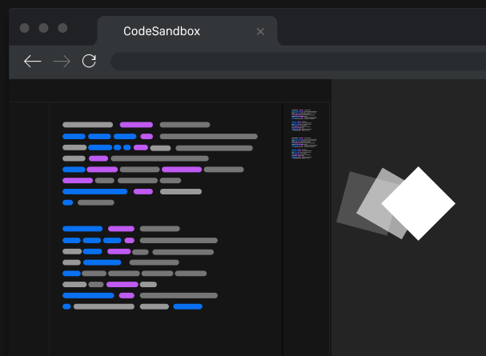

I love the new [CodeSandbox][codesandbox-homepage] homepage 💜
While checking it out, this illustration caught my eye 👇



So, I made **[react-spectrum][spectrum-github-repo]** to generate similar colorful text/code placeholders 🙌

https://codesandbox.io/s/react-spectrum-demo-83c90

**[react-spectrum][spectrum-github-repo]** is configurable and can be used to generate various types of
fancy text placeholders.

```jsx
import React from "react";
// Import library
import Spectrum from "react-spectrum";
// or const Spectrum = require('react-spectrum');

// Render the placeholder
function Placeholder() {
  return (
    <Spectrum
      width={500}
      colors={["#757575", "#999999", "#0871F2", "#BF5AF2"]}
    />
  );
}
```

Give it a try at [github.com/ganapativs/react-spectrum][spectrum-github-repo]
and star it if you like it 🙌
Also, give me a follow [@ganapativs](https://twitter.com/ganapativs)
if you want to see more of these stuff 😬

[codesandbox-homepage]: https://codesandbox.io
[spectrum-github-repo]: https://github.com/ganapativs/react-spectrum

---

**Thanks:**

- [CodeSandbox for the inspiration](https://codesandbox.io)

---
